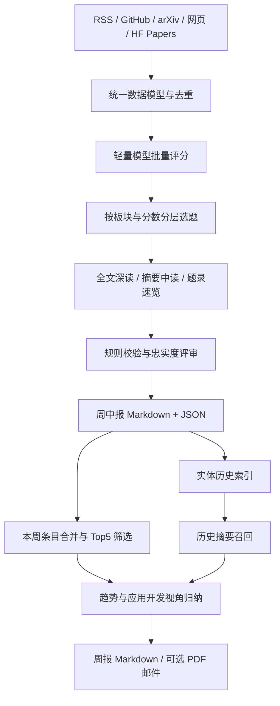

# AI Radar

面向 AI 应用开发者的前沿信息追踪助手。自动采集模型动态、工程实践与论文，完成价值筛选、分层分析和历史关联，生成可回查来源的中文周中报与周报。

项目从个人需求出发：持续关注 AI 进展，但不希望每天重复浏览多个网站，也不希望只得到一份缺少技术背景的新闻标题清单。因此，AI Radar 将阅读过程拆成两层：周中报帮助理解值得关注的具体内容，周报帮助梳理一周重点及其与历史进展的联系。

核心实现是基于 LangGraph 的固定工作流。模型负责评分、分析与归纳，程序负责采集、选题配额、来源管理、校验和状态持久化。

**报告示例**：[周中报](reports/2026-07/midweek-2026-07-23.md) · [周报](reports/2026-07/weekly-2026-07-19.md)

## 整体设计

LangGraph 只承担节点编排和状态传递。采集、模型调用、选题、渲染等业务逻辑分别放在独立模块中，图节点负责调用这些模块；客户端、配置与存储对象通过运行上下文注入。这使业务模块能够脱离图单独验证，测试时也可以替换网络和模型依赖。

## 关键设计思路

### 1. 先统一信息，再判断价值

不同来源的数据形态差异很大：RSS 提供文章列表，GitHub 提供仓库和 Release，论文渠道提供摘要及社区信号，部分官网需要网页解析。项目使用配置驱动的采集器，将这些内容统一为 `NewsItem`，保留标题、来源、原始链接、发布时间和摘要，再进入同一套分析流程。

当前 [sources.yaml](sources.yaml) 配置了 14 个信息源，接入 RSS、GitHub、arXiv、网页抓取和 Hugging Face Daily Papers 共 5 类采集器。复用已有采集方式时，增加来源主要通过配置完成；特殊页面结构仍需专用解析逻辑。

去重发生在模型调用之前。普通链接按规范化 URL 生成标识，清除追踪参数和页内锚点；同一论文的 arXiv 与 Hugging Face 入口则归一到论文 ID，避免同文占据多个席位。再配合配置中的时效窗口，减少重复内容和存量旧闻消耗模型预算。

### 2. 把深度推理留给值得阅读的内容

每条资讯都抓全文并调用高成本模型，会同时增加处理成本和报告长度。AI Radar 使用“批量评分—分层阅读”的漏斗。

- **评分阶段**使用 Flash 模型，每批最多 15 条，只输入标题、摘要与社区信号，返回分数、分类和理由。
- **阅读阶段**使用 Pro 模型分析入选内容。深读额外抓取正文，中读使用摘要，其余内容保留为速览。
- **选题阶段**由代码执行阈值与配额，而不是让模型自由决定报告篇幅。

周中报按模型动态、工程实践、论文三类分别选题，每类最多 1 条深读、1 条中读，最低分数分别为 6 分和 5 分。这样可以避免热门模型发布挤掉工程内容；分数不足时允许席位空缺，不为凑数量生成长分析。

批量评分失败的条目保留为“未打分”，低分条目保留为速览。筛选决定阅读深度，同时保留回查入口。

### 3. 根据输出用途选择模型接口

评分、实体抽取和图片选择需要明确的字段与值域，采用 Function Calling，并在程序侧校验结构、条目 ID 或候选序号。长篇中文分析则走普通文本生成，再由规则检查长度和格式。

这一划分来自项目调试中的接口适配经验：长文本放入工具参数会增加 JSON 转义与解析负担。将长文生成和短结构化结果分开，可以分别处理失败与重试，也避免为了统一接口而让所有任务承担同一种约束。

### 4. 来源由数据层管理，内容由模型分析

报告中的条目来源链接直接取自采集结果，由渲染层插入。周中报的分析正文如果包含模型自行生成的 URL，会触发规则校验。配图也采用类似机制：程序提取候选图，模型根据说明选择序号，程序再完成下载与路径管理。

这让引用有明确的数据来源，减少模型编造链接的风险。它不能保证分析中的每个断言都正确，因此项目还对有正文的深读内容进行忠实度评审，将分析与抓取到的原文对照检查。

### 5. 周报复用已有分析，模型只补充综合判断

周中报同时输出两份产物：Markdown 用于阅读，JSON 保存结构化条目，供后续流程复用。周报读取近 7 天的周中报 JSON，合并去重后选择分数至少为 7 的 Top5，不重复采集和评分。

周报与周中报的选题目标不同。周中报用分类配额保证覆盖面；周报按全局分数选择一周重点。已有标题、来源、分析和图片直接复用，新增模型调用集中在趋势归纳与应用开发、面试视角的综合分析上。

这种分工既减少重复推理，也让周报的输入可以回查到具体的周中报数据。

### 6. 用轻量索引补充历史背景

只看当周资讯，很难理解某个模型或技术的持续演进。项目从深读与中读内容中抽取实体，将实体名映射到历次报道，在生成周报时按 Top5 涉及的实体召回更早的摘要。

当前采用 JSON 倒排索引与实体名精确匹配，每个实体默认取最近 3 条历史记录。对于个人使用的小规模语料，这种实现便于维护，也容易追溯关联依据。

这一取舍同时带来明确边界：实体别名、不同版本命名或语义相近但名称不同的内容可能无法关联。目前未接入向量数据库、知识图谱或 LightRAG，历史关联也不等同于完整的事件演进识别。

## 可靠性与质量控制

项目按失败发生的位置设计处理方式。

- **采集异常**：公共 HTTP 层提供超时和退避重试；单源解析或抓取失败会记录原因，其他来源继续处理，失败源展示在报告尾注。
- **内容降级**：正文抓取失败时可改用摘要分析；打分结构不合法时保留未打分条目；分析格式校验重试后仍失败时，回退到摘要和评分理由。
- **质量评审**：有正文的深读接受独立提示词的 LLM 忠实度评审，低分触发一次重生成，仍未通过则标记低置信。评审调用与生成调用目前使用同一模型配置，评审失败时放行，不能视为事实正确性的保证。
- **状态保存**：报告与索引写出后再保存采集状态和去重记录，状态文件使用临时文件加原子替换，降低中断后留下损坏 JSON 的风险。多文件之间尚无数据库事务保证。
- **可观测性**：报告尾注记录 Token、缓存命中、成本口径和失败来源；可选接入 LangSmith，按评分、深读、评审等阶段追踪模型调用。

目前的增量收录主要依赖已见条目标识和时效窗口。水位线已记录，但尚未接入采集器的请求窗口过滤，不能据此保证任意停机时长后的完整补采。模型网络异常也并非全部被降级处理，部分重试耗尽后的异常仍会使本轮失败。

## 运行方式

项目使用 Python 3.12+ 和 uv 管理依赖。在仓库根目录执行：
